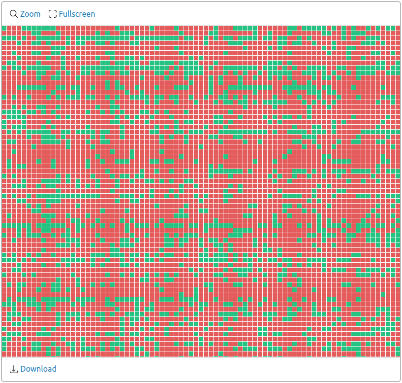

# One Million Submissions

This Go program can be used to visualize Toph's submission verdicts in one large image. It was used to generate the large image shared on Toph's [One Million Submissions](https://blog.toph.co/spotlight/one-million-submissions/) blog post.



## Usage

```
$ go build .
$ ./toph-million
```

```
$ ./toph-million -h
Usage of ./toph-million:
  -ds int
    	size of each dot (default 16)
  -f string
    	name of manifest file (default "manifest.txt")
  -ih int
    	height of output image (default 1260)
  -iw int
    	width of output image (default 2400)
  -o string
    	name of output file (default "background.png")
```
